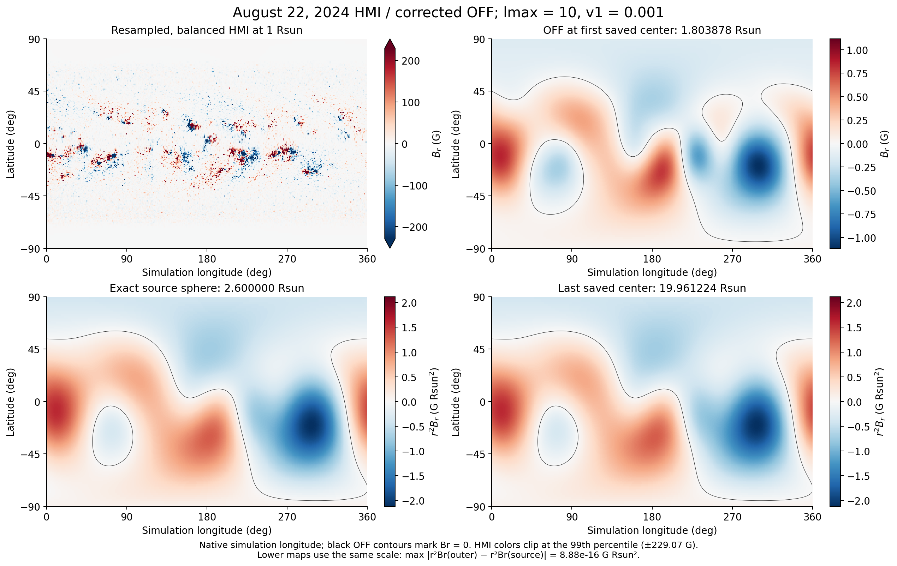
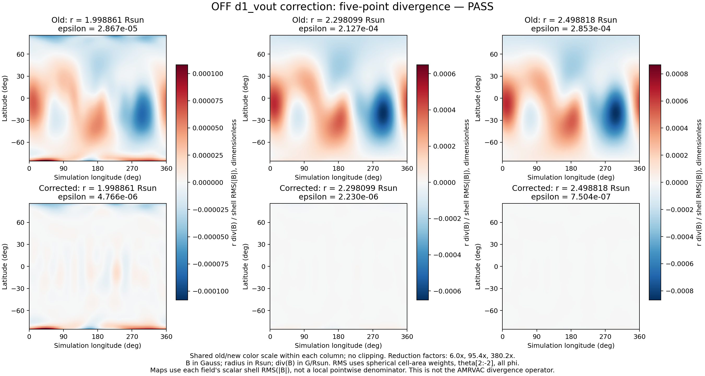

# MagWind

**Global solar coronal magnetic fields with PFSS, SCS, and solar-wind outflow.**

MagWind is a Python research package for extrapolating coronal magnetic fields from photospheric magnetograms. It combines spherical-harmonic solvers, CPU/GPU calculation paths, field-line tools, and VTK visualization exports.

[Models](#models) · [Install](#installation) · [Quick start](#quick-start) · [Validation](#validation-and-recent-corrections) · [Calculation notes](docs/calculation-update.md)



*Example from the validated August 22, 2024 initialization: a flux-balanced HMI map, OFF with `lmax=10` and `v1=0.001 km/s`, and a radial extension beyond `2.6 R_sun`. The upper panels show `Br`; the lower panels show `r²Br` on a common scale. Longitudes are native simulation coordinates. This is an archived case result, not a new calculation by the quick-start example below. [Figure provenance and configuration](docs/images/README.md).*

## Models

| Model | Calculation | Main controls |
| :--- | :--- | :--- |
| **PFSS** — Potential Field Source Surface | A potential magnetic field with a radial-field boundary at the source surface. | `lmax`, source radius `Rs`, mesh dimensions |
| **SCS** — Schatten Current Sheet | Reorient the PFSS cusp field, fit an outer potential field, and restore polarity. Supports direct harmonic evaluation and a selectable PFSS/SCS interface. | Cusp radius `Rcp`, `lmax_scs`, outer radius `Rtp`, `sc_split_radius` |
| **OFF** — Outflow Field | A magnetic equilibrium with a prescribed radial wind in the magneto-frictional formulation, following Rice & Yeates (2021). | `v1`, `Rs`, `lmax`, radial integration |

The implementation provides `(Br, Btheta, Bphi)` arrays, field-line tracing, and VTS/VTU export utilities. `v1` specifies the OFF wind speed at `Rs` in **km/s**; it is separate from any MHD initial-atmosphere prescription. MagWind performs magnetic extrapolation, not time-dependent MHD evolution.

## Installation

Clone the repository and install the package into your Python environment:

```bash
git clone https://github.com/lavenderLi09/MagWind.git
cd MagWind
python -m pip install -e ./codes
```

The installed import name is **`pfss`**. Dependencies include NumPy, SciPy, PyTorch, SunPy, Astropy, Matplotlib, VTK, PyEVTK, Plotly, and scikit-image; see [the package configuration](codes/setup.py). SciPy is currently constrained below 1.17 because legacy paths still use `sph_harm`.

The current regression suite was verified on Python 3.13.7, NumPy 2.3.3, SciPy 1.16.2, and PyTorch 2.9.1. CPU examples do not require CUDA. GPU execution requires a compatible PyTorch/CUDA installation and available GPU memory.

## Quick start

### Evaluate a small PFSS field without downloading a magnetogram

This example supplies **synthetic dipole coefficients** directly. Radii are in solar radii; `theta` is colatitude in radians and `phi` is longitude in radians.

```python
import numpy as np
from pfss.pfss_module import pfss_solver

ps = pfss_solver(None, n_r=3, n_t=8, n_p=12, lmax=1, Rs=2.6)
ps.Alm = {0: {0: 0.0}, 1: {-1: 0.0, 0: -ps.Rs**-3, 1: 0.0}}
ps.Blm = {0: {0: 0.0}, 1: {-1: 0.0, 0: 1.0, 1: 0.0}}

# Each column is one (r, theta, phi) query point.
points = np.array([[1.5, 2.6], [0.7, 1.2], [0.9, 2.0]])
field = ps.get_Brtp(points, method="harmonics", device="cpu")
print(field.shape)  # (3, 2): Br, Btheta, Bphi at two points
```

### Continue with the SCS field

Use the same `ps` from the previous example:

```python
from pfss.scs_module import scs_solver

scs = scs_solver(
    None, Rs=ps.Rs, Rcp=2.4, Rtp=20.0,
    lmax_scs=1, Nrtp_scs=[8, 16, 32],
    Alm=ps.Alm, Blm=ps.Blm, device="cpu",
)
outer_points = np.array([[3.0, 10.0], [0.7, 1.2], [0.9, 2.0]])
outer_field = scs.get_Brtp(
    outer_points,
    method="harmonics",
    sc_split_radius=ps.Rs,
    interface_blend_half_width=0.0,
    device="cpu",
)
print(outer_field.shape)  # (3, 2)
```

By default, the combined field uses PFSS for `r <= Rs` and SCS for `r > Rs`. Set `sc_split_radius=scs.Rcp` to split at the cusp. A positive `interface_blend_half_width` enables smooth blending for harmonic evaluation; it is **off by default and does not enforce zero divergence**. See [interface behavior and limitations](docs/calculation-update.md#scs-interface).

### Work with magnetograms and OFF

The model entry points are:

```python
from pfss.pfss_module import pfss_solver
from pfss.scs_module import scs_solver
from pfss.off_module import off_solver
```

The [`example/`](example/) directory contains HMI FITS inputs and historical saved solver/coefficient files. The main source modules document field generation through `get_pfss`, `multi_gpu_pfss`, `get_scs`, and `get_outflow_field`. Use a separate working directory for each calculation because worker paths write intermediate files there. Python scripts that start multiprocessing workers should use an `if __name__ == "__main__":` guard.

## Coordinates and output conventions

- **Spherical components:** `(Br, Btheta, Bphi)`, in that order.
- **Query coordinates:** `(r, theta, phi)`, with angles in radians and `theta` measured from the north pole.
- **Regular field arrays:** shape `(3, n_r, n_t, n_p)`. Keep the corresponding coordinates when exporting to another mesh.
- **Magnetic units:** follow the input field normalization; the archived HMI/OFF figures here use Gauss.
- **Saved arrays:** NPY for solver fields; the PFSS loader also accepts explicitly supplied legacy NPZ files.

The August case used a separate generator to resample onto the AMRVAC mesh and write its native binary format. Those large field products and the case-specific MHD setup are not included in this repository.

## Validation and recent corrections

The September 2026 update includes:

- **OFF:** corrected wind derivatives and radial equation, signed backward RK4, regular sonic-point evaluation, bounded integration, and conserved signed flux for the retained monopole.
- **PFSS:** corrected axisymmetric-mode counting and azimuthal metric factor, consistent saved component order, and custom-grid worker propagation.
- **SCS:** corrected harmonic-degree handling and sine-mode fitting, consistent cusp-radius normalization, retained PFSS coefficients, and configurable interface/blending options.



*Archived August-case diagnostic: at `r ≈ 2.499 R_sun`, `r × RMS(div B) / RMS(|B|)` decreased from `2.85 × 10⁻⁴` to `7.50 × 10⁻⁷` after correcting `d1_vout`, approximately a **380-fold reduction**. Each column shares its old/new color scale. This measures finite-difference initialization consistency; it is not the AMRVAC divergence operator, an MHD stability test, or a universal improvement factor. [Diagnostic definition and values](docs/images/README.md#divergence-comparison).*

Run the **26-test CPU regression suite** from the repository root:

```bash
PYTHONPATH="$PWD/codes" python -m unittest discover -s codes/tests -v
```

The tests check finite-difference wind derivatives, analytic magnetic fields, independent radial integration, flux conservation, SCS interfaces, saved formats, and real worker processes. PFSS worker tests use supplied analytic coefficients. They do not validate full-resolution GPU runs, fresh PFSS coefficient multiprocessing on macOS/Windows, or MHD evolution.

**Regenerate old magnetic fields to use the numerical corrections.** For migration details and the tested software versions, read [the calculation-update notes](docs/calculation-update.md).

## References

- Rice, O. E. K. & Yeates, A. R. (2021), *Global Coronal Equilibria with Solar Wind Outflow*, The Astrophysical Journal, 923, 57. [Paper](https://doi.org/10.3847/1538-4357/ac2c71) · [Preprint](https://arxiv.org/abs/2110.01319).
- Schatten, K. H., Wilcox, J. M. & Ness, N. F. (1969), *A model of interplanetary and coronal magnetic fields*, Solar Physics, 6, 442–455. [Paper](https://doi.org/10.1007/BF00146478).
- Schatten, K. H. (1971), *Current sheet magnetic model for the solar corona*. [NASA bibliographic record](https://ntrs.nasa.gov/citations/19710060662).

These references describe the underlying models. Implementation choices and numerical corrections specific to MagWind are documented separately above.

## Authors and contributors

**Yihua Li** — Nanjing University, School of Astronomy and Space Science

[GitHub: lavenderLi09](https://github.com/lavenderLi09) · [Email](mailto:yihuali@smail.nju.edu.cn)

**Guoyin Chen** — Nanjing University, School of Astronomy and Space Science / Rosseland Centre for Solar Physics, University of Oslo

[GitHub: gychen-NJU](https://github.com/gychen-NJU)

We thank all contributors for their work and feedback.

## License

MagWind is distributed under the [MIT License](LICENSE).
